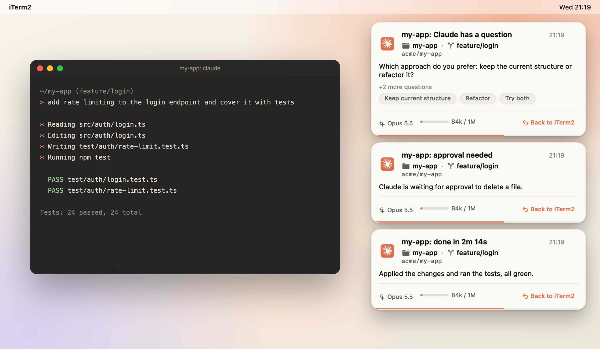
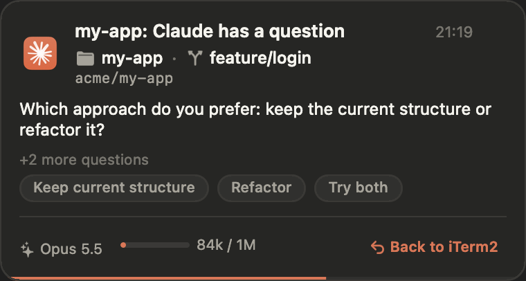
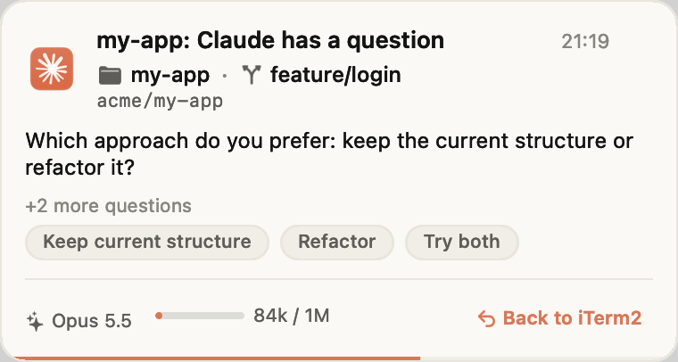
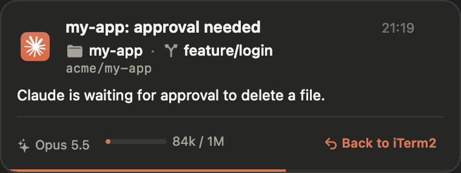
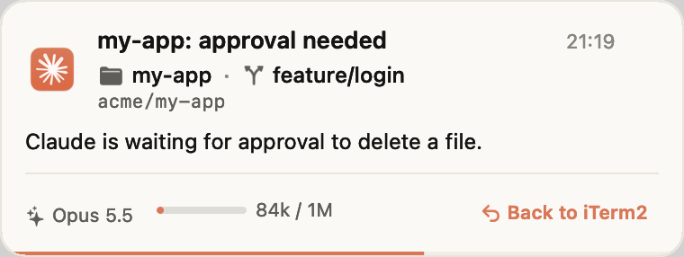
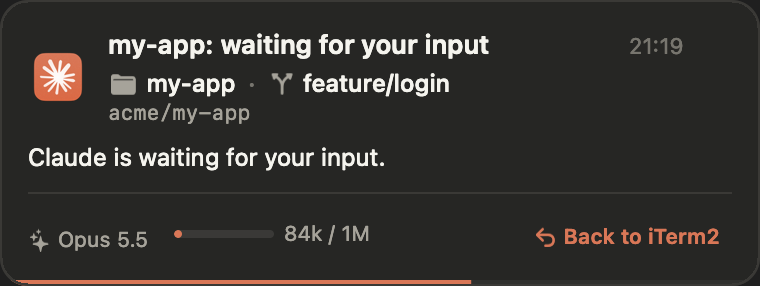
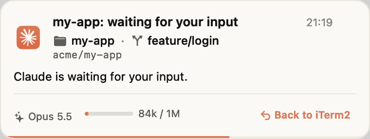
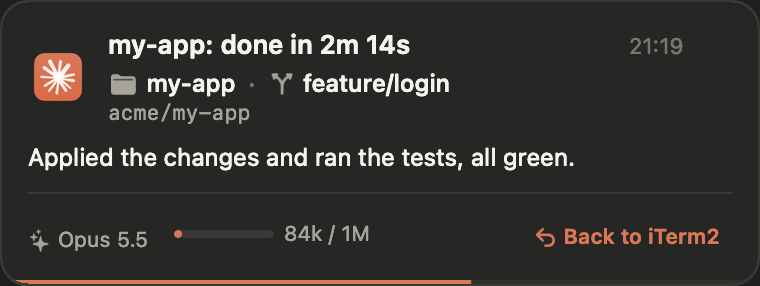
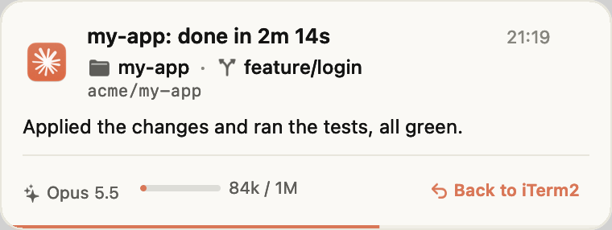

<p align="center"></p>

<p align="center">
  <a href="https://github.com/bahri-hirfanoglu/cla-notify/actions/workflows/ci.yml"></a>
  <a href="https://github.com/bahri-hirfanoglu/cla-notify/releases/latest"></a>
  <a href="LICENSE"></a>
  
</p>

<p align="center"><a href="https://bahri-hirfanoglu.github.io/cla-notify/">Website</a> · <a href="#install">Install</a> · <a href="#configuration-reference">Configuration</a> · <a href="#troubleshooting">Troubleshooting</a></p>

# cla-notify

A Claude Code plugin that shows a desktop notification when Claude asks a question, waits for
approval or input, or finishes a turn. Clicking the notification returns focus to the terminal
the session runs in. Runs on macOS, Linux and Windows.

An unofficial community plugin, not affiliated with Anthropic. Project site:
[bahri-hirfanoglu.github.io/cla-notify](https://bahri-hirfanoglu.github.io/cla-notify/) (source in `docs/`).

## Screenshots

<picture>
  <source media="(prefers-color-scheme: dark)" srcset="docs/screenshots/hero-dark.png">
  
</picture>

Real macOS cards, rendered by the bundled HUD (`cla-notify-hud render`). On Linux and Windows
the same text appears through the system's own notifications.

| | Dark | Light |
|---|---|---|
| **Question** |  |  |
| **Approval** |  |  |
| **Waiting** |  |  |
| **Done** |  |  |

## Install

```
/plugin marketplace add bahri-hirfanoglu/cla-notify
/plugin install cla-notify@cla-notify
```

## Platform notes

- **macOS**: notifications are drawn by a small bundled HUD (`cla-notify-hud`), no other
  software needed.
- **Linux**: needs a running notification daemon (most desktop environments ship one; on a
  minimal setup install `dunst` or similar). For click-to-focus, optionally install `tmux`,
  `xdotool` or `wmctrl`; whichever is present is used, the rest is skipped.
- **Windows**: needs Git Bash, which Claude Code on Windows already requires. Toasts are shown
  through a Start Menu shortcut cla-notify creates on first use.

## Slash commands

- `/cla-notify:config` - change any setting in plain words, or show the current configuration.
- `/cla-notify:test` - show sample notifications (`ask`, `permission`, `idle`, `done`, `all`).
- `/cla-notify:doctor` - diagnostics: presenter check, config and state paths, terminal detection.

## Configuration reference

Config file: `$CLA_NOTIFY_CONFIG`, else macOS/Linux `$XDG_CONFIG_HOME/cla-notify/config.json`
(default `~/.config/cla-notify/config.json`), Windows `%APPDATA%\cla-notify\config.json`. Every
key is optional; missing keys take the defaults below. See `config.example.json` for a full file.

| Key | Default | Meaning |
|---|---|---|
| `enabled` | `true` | Turn all notifications on or off. |
| `events.ask.enabled` | `true` | Show a notification when Claude asks a question. |
| `events.ask.title` | `{project}: Claude has a question` | Title template. |
| `events.ask.body` | `{question}` | Body template. |
| `events.ask.sound` | `default` | Sound for this event. |
| `events.ask.durationSeconds` | `20` | How long the card stays up, in seconds (0 or more; 0 means it stays until dismissed). |
| `events.permission.enabled` | `true` | Show a notification when Claude needs approval. |
| `events.permission.title` | `{project}: approval needed` | Title template. |
| `events.permission.body` | `{message}` | Body template. |
| `events.permission.sound` | `default` | Sound for this event. |
| `events.permission.durationSeconds` | `20` | How long the card stays up, in seconds (0 or more; 0 means it stays until dismissed). |
| `events.idle.enabled` | `true` | Show a notification while waiting for input. |
| `events.idle.title` | `{project}: waiting for your input` | Title template. |
| `events.idle.body` | `{message}` | Body template. |
| `events.idle.sound` | `default` | Sound for this event. |
| `events.idle.durationSeconds` | `12` | How long the card stays up, in seconds (0 or more; 0 means it stays until dismissed). |
| `events.done.enabled` | `true` | Show a notification when a turn finishes. |
| `events.done.title` | `{project}: done in {duration}` | Title template. |
| `events.done.body` | `{summary}` | Body template. |
| `events.done.sound` | `default` | Sound for this event. |
| `events.done.durationSeconds` | `8` | How long the card stays up, in seconds (0 or more; 0 means it stays until dismissed). |
| `events.done.minTurnSeconds` | `0` | Skip the done notification for turns shorter than this, in seconds (0 or more). |
| `display.corner` | `top-right` | `top-right`, `top-left`, `bottom-right` or `bottom-left`. |
| `display.screen` | `auto` | `auto`, `main` or `mouse`. |
| `display.theme` | `auto` | `auto`, `light` or `dark`. |
| `display.respectDock` | `true` | Keep cards clear of the macOS dock. |
| `display.maxCards` | `3` | How many cards can stack before the oldest closes (1 to 10). |
| `display.suppressWhenFocused` | `true` | Skip the notification when the terminal is already frontmost. |
| `display.showOptions` | `true` | Show answer options on an ask card. |
| `display.showContext` | `true` | Show context window usage. |
| `display.showModel` | `true` | Show the model name. |
| `display.showGit` | `true` | Show branch and repo. |
| `sound.volume` | `0.6` | Notification sound volume (0 to 1). |
| `labels.ask` | `Question` | Kind label on an ask card. |
| `labels.wait` | `Waiting` | Kind label on a wait card. |
| `labels.done` | `Done` | Kind label on a done card. |
| `labels.focusButton` | `Back to {app}` | The button that brings the terminal to front. |
| `labels.dismiss` | `Dismiss` | The dismiss button text. |
| `labels.moreQuestions` | `+{count} more questions` | Shown when a question has more options than fit. |
| `contextWindow.default` | `200000` | Context window size assumed for an unlisted model (greater than 0). |
| `contextWindow.models.opus` | `1000000` | Context window size for `opus` (greater than 0). |
| `contextWindow.models.sonnet` | `1000000` | Context window size for `sonnet` (greater than 0). |

### Template placeholders

`{project}` `{path}` `{branch}` `{repo}` `{model}` `{context}` (e.g. `84k / 1M`)
`{contextPercent}` `{duration}` (e.g. `2m 14s`) `{question}` `{options}` `{message}` `{summary}`
`{app}` `{event}` `{count}` (`labels.moreQuestions` only). Unknown placeholders are left as
written; empty values render as empty and doubled separators like `": "` at the end are trimmed.

`sound` values: `"default"` for the platform's default notification sound, `"none"` or `""` for
silent, or a file path (`~` expands) or platform sound name.

## CLI

```
cla-notify hook                                  read one hook event from stdin
cla-notify test [ask|permission|idle|done|all] [--dry-run]
cla-notify config path|show [--defaults]|init [--force]|get <key>|set <key> <value>|unset <key>|validate|reset
cla-notify doctor                                platform, presenter, config, state, terminal
cla-notify focus <card.json>                     bring a card's terminal to the front
cla-notify version
```

## Troubleshooting

Run `/cla-notify:doctor` (or `cla-notify doctor` directly). It reports the platform, the
presenter for this OS and whether it passes its own check, the config file path and whether it
validates, the state directory, and the terminal cla-notify detected for the current shell. If
notifications do not appear, start there.

## Uninstall and reset

Remove the plugin with `/plugin uninstall cla-notify@cla-notify`. To reset settings without
uninstalling, run `cla-notify config reset`, which deletes the config file so defaults apply
again.

## Building from source

Go is not assumed on the host; `scripts/build.sh` uses a local `go` if present, otherwise
`docker run --rm -v "$PWD":/src -w /src golang:1.25 ...`. It cross-compiles darwin (universal
via `lipo`), linux amd64/arm64 and windows amd64/arm64 into `dist/`, and on macOS also builds the
Swift HUD (`scripts/build-hud.sh`). Run `make check` (tests, `go vet` for every target OS and the
no-dash text check) before committing.

## Contributing

See `CLAUDE.md` for the project's rules (English only, no em/en dash, comment style, commit
style, file ownership) and [CONTRIBUTING.md](CONTRIBUTING.md) for dev setup, testing cards and
the PR workflow. Participation is governed by the
[Code of Conduct](CODE_OF_CONDUCT.md). Report vulnerabilities per
[SECURITY.md](SECURITY.md), not in a public issue.
